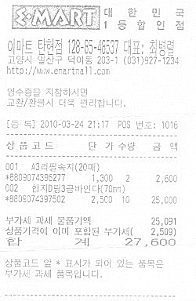

## 주요 기능
- DiT 기반 문서 유형 자동 분류 
- PaddleOCR 한국어 텍스트 추출 및 위치 검출
- Donut 모델 영수증 정보 자동 구조화
- LayoutLMv3 문서 레이아웃 분석 및 정보 추출
- Ko-SRoBERTa 벡터 임베딩 기반 의미 검색
- KoBART 한국어 문서 자동 요약
- SQLModel + SQLite 문서 메타데이터 관리
- Streamlit 웹 기반 사용자 인터페이스

### OCR 결과

